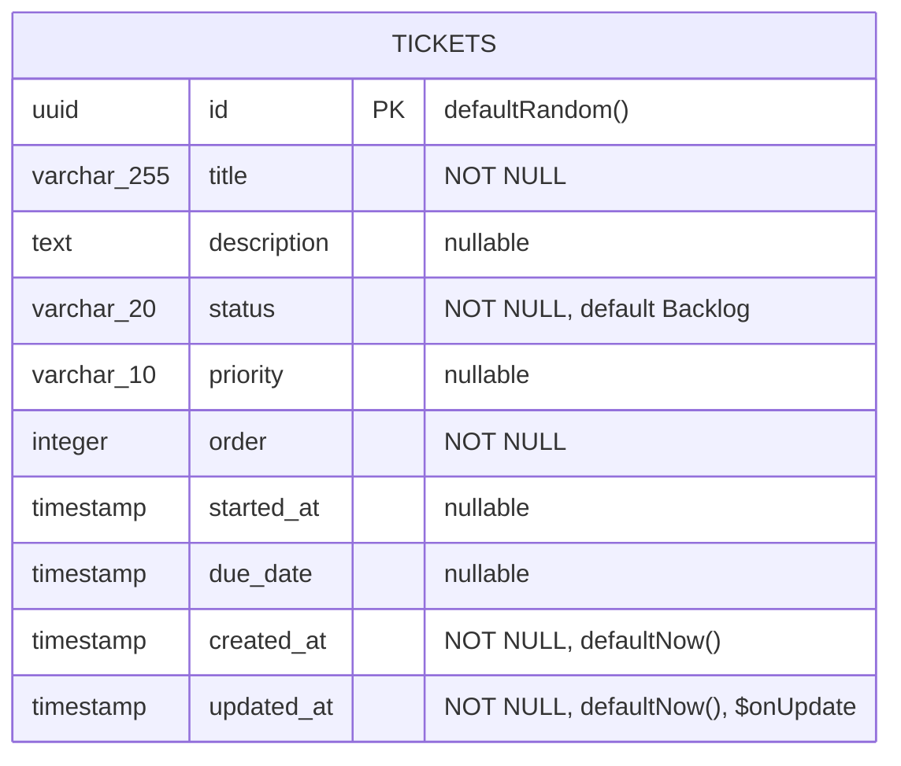

# DATA_MODEL.md — TicketTodo

> 작성일: 2026-06-11
> 버전: v1.0
> 기반 문서: REQUIREMENTS.md v1.0, TRD.md v1.1
> 상태: 확정

---

## 0. 선행 결정 사항 (TRD §3-1 충돌 고지)

아래 4개 항목은 TRD §3-1 스키마 정의와 다르게 확정되었다.
**TRD.md §3-1 및 §7-2 코드 예시의 개정이 필요하다.**

| 항목 | TRD §3-1 (현행) | 이 문서 결정 (우선) | 결정 근거 |
|------|-----------------|---------------------|-----------|
| `status` 컬럼 타입 | `pgEnum('status', [...])` | `varchar(20)` + Zod 검증 | Postgres enum DDL 변경 비용·마이그레이션 복잡도 감소 |
| `priority` 컬럼 타입 | `pgEnum('priority', [...])` | `varchar(10)` + Zod 검증 | 동일 |
| `started_at` 컬럼 타입 | `date('started_at')` | `timestamp('started_at')` | `getDeadlineStyle()` 시간 연산 호환, ISO 직렬화 일관성 |
| `due_date` 컬럼 타입 | `date('due_date')` | `timestamp('due_date')` | 동일 |

> 이 문서의 스키마·타입·시드 코드는 위 결정을 기준으로 작성되었다.
> TRD.md는 별도 개정 전까지 이 문서가 스키마 정의의 Single Source of Truth다.

---

## 1. ERD



> 단일 테이블 구조. 관계형 조인 없음 (MVP 단일 사용자 구조 — REQUIREMENTS.md §1).

---

## 2. 테이블 정의표

### tickets

| 컬럼명 | PostgreSQL 타입 | NULL 허용 | 기본값 | 제약 / 비고 |
|--------|-----------------|:---------:|--------|-------------|
| `id` | `uuid` | ✗ | `gen_random_uuid()` | PK |
| `title` | `varchar(255)` | ✗ | — | 최소 1자, 최대 255자 (NFR-016) |
| `description` | `text` | ✓ | — | — |
| `status` | `varchar(20)` | ✗ | `'Backlog'` | Zod 허용값: `Backlog \| TODO \| In Progress \| Done` |
| `priority` | `varchar(10)` | ✓ | — | Zod 허용값: `Low \| Medium \| High` |
| `order` | `integer` | ✗ | — | 칼럼 내 정렬 순서, 1000 단위 간격 권장 (NFR-015) |
| `started_at` | `timestamp` | ✓ | — | 시작 예정일 (FR-001) |
| `due_date` | `timestamp` | ✓ | — | 종료 예정일, 기한 경고 기준 (FR-012~014) |
| `created_at` | `timestamp` | ✗ | `now()` | 생성 시각 자동 삽입 |
| `updated_at` | `timestamp` | ✗ | `now()` | 수정 시각 자동 갱신 (`$onUpdate`) |

### 인덱스 권장

| 인덱스 이름 | 컬럼 | 용도 |
|-------------|------|------|
| `idx_tickets_status_order` | `(status, order)` | `GET /api/tickets` 칼럼별 그룹핑 + order 정렬 (FR-002) |
| `idx_tickets_due_date` | `(due_date)` | 기한 임박·초과 필터 정렬 지원 (FR-017, FR-018) |

---

## 3. Drizzle 스키마

```typescript
// src/server/db/schema.ts
import {
  pgTable,
  varchar,
  text,
  integer,
  uuid,
  timestamp,
  index,
} from 'drizzle-orm/pg-core';

export const tickets = pgTable(
  'tickets',
  {
    id:          uuid('id').defaultRandom().primaryKey(),
    title:       varchar('title', { length: 255 }).notNull(),
    description: text('description'),
    status:      varchar('status',   { length: 20 }).notNull().default('Backlog'),
    priority:    varchar('priority', { length: 10 }),
    order:       integer('order').notNull(),
    startedAt:   timestamp('started_at'),
    dueDate:     timestamp('due_date'),
    createdAt:   timestamp('created_at').notNull().defaultNow(),
    updatedAt:   timestamp('updated_at').notNull().defaultNow().$onUpdate(() => new Date()),
  },
  (table) => [
    index('idx_tickets_status_order').on(table.status, table.order),
    index('idx_tickets_due_date').on(table.dueDate),
  ],
);

export type TicketRow    = typeof tickets.$inferSelect;
export type NewTicketRow = typeof tickets.$inferInsert;
```

---

## 4. TypeScript 타입

### 4-1. 공유 상수 및 리터럴 타입

```typescript
// src/shared/constants/status.ts
export const COLUMN_STATUSES = ['Backlog', 'TODO', 'In Progress', 'Done'] as const;
export const PRIORITIES      = ['Low', 'Medium', 'High'] as const;

export type ColumnStatus = (typeof COLUMN_STATUSES)[number];
// 'Backlog' | 'TODO' | 'In Progress' | 'Done'

export type Priority = (typeof PRIORITIES)[number];
// 'Low' | 'Medium' | 'High'

export const DUE_WARNING_DAYS = 3; // D-3 임박 기준 (FR-012)

export function getDeadlineStyle(dueDate: string | null, status: ColumnStatus): string {
  if (!dueDate || status === 'Done') return 'border-gray-200'; // FR-014
  const today = new Date();
  today.setHours(0, 0, 0, 0);
  const due = new Date(dueDate); // ISO 8601 문자열 → Date
  due.setHours(0, 0, 0, 0);
  const diffDays = Math.ceil((due.getTime() - today.getTime()) / (1000 * 60 * 60 * 24));

  if (diffDays < 0)                    return 'border-red-500';    // 기한 초과 (FR-013)
  if (diffDays <= DUE_WARNING_DAYS)    return 'border-orange-400'; // D-3 이내 (FR-012)
  return 'border-gray-200';                                         // 기본 (FR-014)
}
// diffDays === 0 (당일)은 초과가 아니므로 orange 처리 — WCAG AA 4.5:1 준수 (NFR-012)
```

### 4-2. DB 모델 타입과 API 응답 DTO

```typescript
// src/shared/types/ticket.ts
import type { ColumnStatus, Priority } from '@/shared/constants/status';

/**
 * DB 모델: Drizzle $inferSelect와 동일한 형태 (날짜 = Date 객체)
 * ticketService 내부에서만 사용한다.
 */
export type TicketRow = {
  id:          string;
  title:       string;
  description: string | null;
  status:      string;        // varchar — Zod 통과 후 ColumnStatus로 단언
  priority:    string | null; // varchar — Zod 통과 후 Priority로 단언
  order:       number;
  startedAt:   Date | null;
  dueDate:     Date | null;
  createdAt:   Date;
  updatedAt:   Date;
};

/**
 * API 응답 DTO: 날짜를 ISO 8601 문자열로 직렬화
 * Route Handler가 클라이언트에 반환하는 형태다.
 */
export type TicketDto = {
  id:          string;
  title:       string;
  description: string | null;
  status:      ColumnStatus;
  priority:    Priority | null;
  order:       number;
  startedAt:   string | null; // ISO 8601
  dueDate:     string | null; // ISO 8601
  createdAt:   string;        // ISO 8601
  updatedAt:   string;        // ISO 8601
};

/** TicketRow → TicketDto 변환 헬퍼 */
export function toTicketDto(row: TicketRow): TicketDto {
  return {
    id:          row.id,
    title:       row.title,
    description: row.description,
    status:      row.status   as ColumnStatus,
    priority:    row.priority as Priority | null,
    order:       row.order,
    startedAt:   row.startedAt?.toISOString() ?? null,
    dueDate:     row.dueDate?.toISOString()   ?? null,
    createdAt:   row.createdAt.toISOString(),
    updatedAt:   row.updatedAt.toISOString(),
  };
}
```

---

## 5. 비즈니스 규칙

### 5-1. order 관리 (NFR-015)

| 상황 | 계산 방법 |
|------|-----------|
| 칼럼 최하단 삽입 | `MAX(order) + 1000` |
| 카드 사이 삽입 | `Math.floor((prevOrder + nextOrder) / 2)` |
| 충돌 감지 (차이 ≤ 1) | 해당 칼럼 전체 order를 `1000, 2000, 3000, …` 으로 재정규화 |

- 최초 삽입 order는 `1000`에서 시작한다 (FR-001)
- 재정규화는 충돌 감지 시에만 수행해 불필요한 DB 업데이트를 최소화한다 (NFR-015)

### 5-2. 기한 경고 D-day 계산 (FR-012~014, NFR-012)

`getDeadlineStyle()` 입력은 `TicketDto.dueDate`(ISO 8601 문자열)이며, 반환값은 Tailwind 테두리 클래스다.

| diffDays | 상태 | 반환 클래스 | 연관 FR |
|----------|------|-------------|---------|
| < 0 | 기한 초과 | `border-red-500` | FR-013 |
| 0 ~ 3 | D-3 이내 임박 | `border-orange-400` | FR-012 |
| ≥ 4 또는 dueDate 없음 | 기본 | `border-gray-200` | FR-014 |
| status = `Done` | 경고 없음 | `border-gray-200` | FR-012~014 |

함수 구현은 §4-1 참조.

### 5-3. 필터 OR 조건 (FR-017, FR-018)

| 필터 버튼 | 조건 | 연관 FR |
|-----------|------|---------|
| 이번주 업무 | `dueDate` ∈ [이번 주 월요일 00:00, 이번 주 일요일 23:59:59] | FR-018 |
| 일정이 초과된 업무 | `dueDate < today 00:00` AND `status !== 'Done'` | FR-017 |
| 두 필터 동시 활성 | 위 두 조건의 합집합 (OR) | FR-017, FR-018 |

- 필터 로직은 **클라이언트 전용** — `GET /api/tickets`는 항상 전체 반환
- 필터 활성 중 DnD 조작은 필터를 유지한 채 상태 변경이 정상 동작해야 한다 (FR-018)

---

## 6. 시드 데이터

아래 seed.ts는 4개 칼럼을 모두 채우며, 기한 경고 3색(red·orange·gray)이 보드에 동시에 표시되도록 설계되었다.

```typescript
// src/server/db/seed.ts
// 실행: NODE_ENV=development npx tsx --env-file=.env.local src/server/db/seed.ts
// (Node.js 20.6+ 기준. 구버전: npm i -D dotenv 후 --require dotenv/config 사용)

import { db } from '@/server/db/index';
import { tickets } from '@/server/db/schema';

// 프로덕션 실행 차단 가드
if (process.env.NODE_ENV === 'production') {
  console.error('[seed] 프로덕션 환경에서는 실행할 수 없습니다.');
  process.exit(1);
}

/** today 00:00:00 기준으로 offset일 이후 Date 반환 */
function dayOffset(offset: number): Date {
  const d = new Date();
  d.setHours(0, 0, 0, 0);
  d.setDate(d.getDate() + offset);
  return d;
}

async function seed(): Promise<void> {
  await db.delete(tickets); // 기존 데이터 전체 삭제

  await db.insert(tickets).values([

    // ─── Backlog ─────────────────────────────────────────────────
    {
      title:       '사용자 인터뷰 계획 수립',
      description: '다음 분기 신기능 검증을 위한 인터뷰 대상자 선정',
      status:      'Backlog',
      priority:    'Medium',
      order:       1000,
      dueDate:     dayOffset(14), // gray — D+14, 경고 없음 (FR-014)
    },
    {
      title:       '경쟁사 분석 리포트 작성',
      description: null,
      status:      'Backlog',
      priority:    'Low',
      order:       2000,
      dueDate:     null,          // gray — dueDate 없음 (FR-014)
    },

    // ─── TODO ────────────────────────────────────────────────────
    {
      title:       '스프린트 백로그 우선순위 정리',
      description: '다음 스프린트 착수 전 항목 재조정',
      status:      'TODO',
      priority:    'High',
      order:       1000,
      startedAt:   dayOffset(0),
      dueDate:     dayOffset(2),  // orange — D+2, D-3 이내 (FR-012)
    },
    {
      title:       'API 문서 초안 작성',
      description: 'OpenAPI 스펙 기반 Swagger 문서 초안',
      status:      'TODO',
      priority:    'Medium',
      order:       2000,
      dueDate:     dayOffset(7),  // gray — D+7, 경고 없음 (FR-014)
    },

    // ─── In Progress ─────────────────────────────────────────────
    {
      title:       '결제 모듈 버그 수정',
      description: '카드 결제 실패 시 오류 메시지 미표시 이슈',
      status:      'In Progress',
      priority:    'High',
      order:       1000,
      startedAt:   dayOffset(-5),
      dueDate:     dayOffset(-2), // red — D-2 초과 (FR-013)
    },
    {
      title:       '대시보드 차트 리팩토링',
      description: 'Recharts → 자체 SVG 컴포넌트로 교체',
      status:      'In Progress',
      priority:    'Medium',
      order:       2000,
      startedAt:   dayOffset(-1),
      dueDate:     dayOffset(1),  // orange — D+1, D-3 이내 (FR-012)
    },
    {
      title:       '모바일 반응형 QA',
      description: '360px ~ 768px 구간 레이아웃 검증',
      status:      'In Progress',
      priority:    'Low',
      order:       3000,
      dueDate:     dayOffset(10), // gray — D+10, 경고 없음 (FR-014)
    },

    // ─── Done ────────────────────────────────────────────────────
    {
      title:       '로그인 페이지 UI 구현',
      description: '디자인 시스템 컴포넌트 적용 완료',
      status:      'Done',
      priority:    'High',
      order:       1000,
      startedAt:   dayOffset(-10),
      dueDate:     dayOffset(-3), // Done이므로 경고 없음 (FR-012~014)
    },
  ]);

  console.log('[seed] 완료: 8개 티켓 삽입');
}

seed().catch((err: unknown) => {
  console.error('[seed] 오류:', err);
  process.exit(1);
});
```

**시드 데이터 경고 색상 요약**

| 칼럼 | 티켓 | dueDate | 기대 색상 | 근거 |
|------|------|---------|-----------|------|
| In Progress | 결제 모듈 버그 수정 | D-2 | 빨간색 `border-red-500` | FR-013 |
| TODO | 스프린트 백로그 정리 | D+2 | 주황색 `border-orange-400` | FR-012 |
| In Progress | 대시보드 차트 리팩토링 | D+1 | 주황색 `border-orange-400` | FR-012 |
| Backlog | 사용자 인터뷰 계획 수립 | D+14 | 무채색 `border-gray-200` | FR-014 |
| Done | 로그인 페이지 UI 구현 | D-3 | 무채색 `border-gray-200` | Done 제외 규칙 |

---

## 7. 변경 이력

| 버전 | 날짜 | 변경 내용 |
|------|------|-----------|
| v1.0 | 2026-06-11 | 최초 작성. REQUIREMENTS.md v1.0 + TRD.md v1.1 기반. status/priority varchar 확정, startedAt/dueDate timestamp 확정 |
