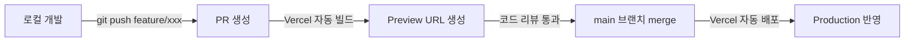

# TRD.md — TicketTodo

> 작성일: 2026-06-11
> 버전: v1.0
> 기반 문서: PRD.md v1.0, REQUIREMENTS.md v1.0
> 상태: 초안

---

## 1. 시스템 아키텍처

### 1-1. 전체 구조

TicketTodo는 **Vercel 단일 배포** 구조를 채택한다.  
Next.js App Router, API Routes, Vercel Postgres를 단일 프로젝트에서 운영하며, 별도의 백엔드 서버나 외부 API 서버 없이 Vercel Serverless Functions가 백엔드 역할을 담당한다.

### 1-2. 아키텍처 다이어그램

```mermaid
graph TD
    subgraph Client["클라이언트 (Browser)"]
        A[React Component]
        B[ticketApi.ts<br/>API 래퍼]
    end

    subgraph Vercel["Vercel Serverless"]
        C[Route Handler<br/>app/api/tickets/route.ts<br/>app/api/tickets/[id]/route.ts]
        D[ticketService.ts<br/>src/server/services/]
        E[Drizzle ORM<br/>src/server/db/]
    end

    subgraph DB["Vercel Postgres (Neon)"]
        F[(tickets 테이블)]
    end

    subgraph Shared["공유 레이어"]
        G[src/shared/<br/>types / schemas / constants]
    end

    A -->|HTTP fetch| B
    B -->|GET/POST/PATCH/DELETE| C
    C -->|서비스 호출| D
    D -->|쿼리| E
    E -->|SQL| F

    G -.->|공유 타입·Zod 스키마| A
    G -.->|공유 타입·Zod 스키마| C
```

### 1-3. 디렉토리 구조

```
tickettodo/
├── app/
│   ├── api/                        # 백엔드 진입점 (Route Handler만 위치)
│   │   └── tickets/
│   │       ├── route.ts            # GET /api/tickets, POST /api/tickets
│   │       └── [id]/
│   │           └── route.ts        # GET/PATCH/DELETE /api/tickets/:id
│   ├── layout.tsx
│   └── page.tsx
├── src/
│   ├── server/                     # 백엔드 전용 로직 (클라이언트에서 import 금지)
│   │   ├── db/
│   │   │   ├── index.ts            # Drizzle 클라이언트 초기화
│   │   │   └── schema.ts           # tickets 테이블 스키마 정의
│   │   └── services/
│   │       └── ticketService.ts    # DB 접근 비즈니스 로직
│   ├── client/                     # 프론트엔드 전용 로직 (서버에서 import 금지)
│   │   ├── api/
│   │   │   └── ticketApi.ts        # fetch 기반 API 래퍼
│   │   ├── components/
│   │   │   ├── Board/              # 칸반 보드 컴포넌트
│   │   │   ├── Card/               # 티켓 카드 컴포넌트
│   │   │   ├── Column/             # 칼럼 컴포넌트
│   │   │   └── Modal/              # 생성·상세 모달 컴포넌트
│   │   └── hooks/
│   │       ├── useTickets.ts       # 티켓 데이터 패칭·상태 관리
│   │       └── useDnd.ts           # DnD 이벤트 핸들러
│   └── shared/                     # 클라이언트·서버 양쪽에서 참조 가능
│       ├── types/
│       │   └── ticket.ts           # Ticket 타입 정의
│       ├── schemas/
│       │   └── ticketSchema.ts     # Zod 스키마 (클라이언트·서버 공용)
│       └── constants/
│           └── status.ts           # ColumnStatus enum, 기한 임박 임계값 등
├── drizzle/
│   └── migrations/                 # Drizzle 마이그레이션 파일
├── drizzle.config.ts
├── .env.local                      # 로컬 환경 변수 (gitignore)
└── package.json
```

---

## 2. 기술 스택 상세

### 2-1. 스택 요약표

| 레이어      | 기술                                          | 버전 |
| ----------- | --------------------------------------------- | ---- |
| 프레임워크  | Next.js (App Router + API Routes)             | 15   |
| 런타임      | Node.js (Vercel Serverless Functions 타겟)    | —    |
| DB          | Vercel Postgres (Neon 기반)                   | —    |
| ORM         | Drizzle ORM                                   | —    |
| DnD         | @dnd-kit/core (Mouse / Touch / Keyboard 센서) | —    |
| 언어        | TypeScript                                    | —    |
| 스타일      | Tailwind CSS                                  | 4    |
| 유효성 검증 | Zod                                           | —    |
| 테스트      | Jest + React Testing Library                  | —    |
| Lint        | ESLint + Prettier                             | —    |
| 배포        | Vercel (main 브랜치 자동 배포)                | —    |

> ⚠️ 버전 명시 없는 항목은 PRD.md 기술 스택 요약표에 버전이 기재되어 있지 않음. 확정 버전은 package.json 기준으로 관리.

### 2-2. 핵심 스택 선정 이유 및 대안 비교

#### 프레임워크: Next.js 15 (App Router)

| 항목   | Next.js 15 (App Router)                   | Remix                                           | Vite + React SPA                     |
| ------ | ----------------------------------------- | ----------------------------------------------- | ------------------------------------ |
| 선정   | ✅ 채택                                    | —                                               | —                                    |
| 이유   | Vercel 공식 지원, SSR/RSC/API Routes 통합 | Vercel 호환이나 Next.js 대비 Vercel 최적화 부족 | API 서버 별도 필요, Vercel 통합 복잡 |
| 주요점 | App Router로 레이아웃·로딩 스트리밍 지원  | Loader/Action 패턴 명확                         | 번들 경량, 그러나 백엔드 분리 필요   |

#### DB: Vercel Postgres (Neon 기반)

| 항목   | Vercel Postgres (Neon)                                                 | Supabase Postgres                   | PlanetScale (MySQL)                                    |
| ------ | ---------------------------------------------------------------------- | ----------------------------------- | ------------------------------------------------------ |
| 선정   | ✅ 채택                                                                 | —                                   | —                                                      |
| 이유   | Vercel Dashboard 통합, 서버리스 커넥션 풀 자동 관리, Drizzle 공식 지원 | Vercel 통합 가능하나 설정 추가 필요 | MySQL 기반, Drizzle 지원하나 Postgres 대비 생태계 제한 |
| 주요점 | `@vercel/postgres` SDK로 바로 연결                                     | Row Level Security 등 부가 기능     | Branching 기능 유용하나 단일 사용자 앱에 과함          |

#### ORM: Drizzle ORM

| 항목   | Drizzle ORM                                                 | Prisma                                                     | Kysely                             |
| ------ | ----------------------------------------------------------- | ---------------------------------------------------------- | ---------------------------------- |
| 선정   | ✅ 채택                                                      | —                                                          | —                                  |
| 이유   | Vercel Postgres 공식 지원, 코드 생성 불필요, 타입 추론 강력 | 코드 생성 필요 (`prisma generate`), Cold Start 영향 가능   | 타입 안전하나 스키마 정의 DSL 없음 |
| 주요점 | SQL에 가까운 쿼리 빌더, 마이그레이션 CLI 제공               | 풍부한 생태계, 그러나 Serverless 환경 Cold Start 이슈 존재 | Raw SQL 대비 약간의 추상화         |

---

## 3. 데이터 모델

### 3-1. tickets 테이블 스키마

```typescript
// src/server/db/schema.ts
// 인덱스 포함 전체 스키마 정의는 docs/DATA_MODEL.md §3 참조 (SSOT)
import { pgTable, varchar, text, integer, uuid, timestamp } from 'drizzle-orm/pg-core';

export const tickets = pgTable('tickets', {
  id:          uuid('id').defaultRandom().primaryKey(),
  title:       varchar('title', { length: 255 }).notNull(),
  description: text('description'),
  status:      varchar('status',   { length: 20 }).notNull().default('Backlog'),
  priority:    varchar('priority', { length: 10 }),
  order:       integer('order').notNull(),
  startedAt:   timestamp('started_at'),
  dueDate:     timestamp('due_date'),
  createdAt:   timestamp('created_at').notNull().defaultNow(),
  updatedAt:   timestamp('updated_at').notNull().defaultNow().$onUpdate(() => new Date()),
});

export type Ticket    = typeof tickets.$inferSelect;
export type NewTicket = typeof tickets.$inferInsert;
```

### 3-2. 공유 타입 및 Zod 스키마

```typescript
// src/shared/schemas/ticketSchema.ts
import { z } from 'zod';

export const TicketStatusEnum = z.enum(['Backlog', 'TODO', 'In Progress', 'Done']);
export const PriorityEnum     = z.enum(['Low', 'Medium', 'High']);

export const createTicketSchema = z.object({
  title:       z.string().min(1).max(255),
  description: z.string().optional(),
  priority:    PriorityEnum.optional(),
  startedAt:   z.string().datetime().optional(),
  dueDate:     z.string().datetime().optional(),
});

export const updateTicketSchema = z.object({
  title:       z.string().min(1).max(255).optional(),
  description: z.string().optional(),
  priority:    PriorityEnum.optional(),
  status:      TicketStatusEnum.optional(),
  order:       z.number().int().optional(),
  startedAt:   z.string().datetime().optional().nullable(),
  dueDate:     z.string().datetime().optional().nullable(),
});

export type CreateTicketInput = z.infer<typeof createTicketSchema>;
export type UpdateTicketInput = z.infer<typeof updateTicketSchema>;
```

---

## 4. 데이터 흐름 및 아키텍처 원칙

### 4-1. 읽기 흐름

```
컴포넌트 (useTickets hook)
  → ticketApi.ts (GET /api/tickets)
  → Route Handler (app/api/tickets/route.ts)
  → ticketService.ts (getAllTickets)
  → Drizzle ORM
  → Vercel Postgres
```

```typescript
// src/client/api/ticketApi.ts
export const ticketApi = {
  getAll: async (): Promise<Ticket[]> => {
    const res = await fetch('/api/tickets');
    if (!res.ok) throw new Error('Failed to fetch tickets');
    return res.json();
  },
  // ...
};
```

### 4-2. 쓰기 흐름

```
Form (사용자 입력)
  → 클라이언트 Zod 검증 (createTicketSchema)
  → ticketApi.ts (POST /api/tickets, body: CreateTicketInput)
  → Route Handler (요청 파싱)
  → 서버 Zod 검증 (createTicketSchema) ← 클라이언트 우회 방어
  → ticketService.ts (createTicket)
  → Drizzle ORM
  → Vercel Postgres
```

> 클라이언트·서버 양단 이중 검증으로 무결성 보장. 동일한 Zod 스키마(`src/shared/schemas/`)를 공유해 중복 정의 제거.

### 4-3. 드래그 앤 드롭 흐름

```
DnD onDragEnd 이벤트
  → 낙관적 업데이트 (클라이언트 상태 즉시 반영)
  → ticketApi.ts (PATCH /api/tickets/:id, { status, order })
  → Route Handler → ticketService.ts (updateTicket)
    → position 재계산 (중간값 방식)
    → DB 업데이트
  → 성공: 서버 응답값으로 클라이언트 상태 재동기화
  → 실패: 드롭 이전 상태로 롤백 + 토스트 에러 표시
```

**order 재계산 방식 (중간값 삽입)**

| 상황             | 계산 방법                                       |
| ---------------- | ----------------------------------------------- |
| 칼럼 최하단 삽입 | `MAX(order) + 1000`                             |
| 카드 사이 삽입   | `Math.floor((prevOrder + nextOrder) / 2)`       |
| 충돌 감지        | 차이가 1 이하이면 해당 칼럼 전체 order 재정규화 |

---

## 5. 계층 간 경계 규칙

| 규칙                                           | 설명                                                      |
| ---------------------------------------------- | --------------------------------------------------------- |
| `src/server/` ↔ `src/client/` 상호 import 금지 | 서버 코드(DB 연결, 서비스)가 클라이언트에 노출되지 않도록 |
| `src/shared/` 양방향 참조 허용                 | 타입·Zod 스키마·상수만 위치                               |
| Route Handler 얇게 유지                        | 요청 파싱 → 서비스 호출 → 응답 반환 3단계만               |
| 서비스 레이어 순수하게 유지                    | HTTP 관련 객체(`Request`, `Response`) 미사용              |
| DB 접근은 서비스 레이어 전용                   | Route Handler에서 직접 Drizzle 쿼리 작성 금지             |

**Route Handler 구조 예시**

```typescript
// app/api/tickets/route.ts
import { NextRequest, NextResponse } from 'next/server';
import { createTicketSchema } from '@/shared/schemas/ticketSchema';
import { ticketService } from '@/server/services/ticketService';

export async function POST(req: NextRequest) {
  const body = await req.json();
  const parsed = createTicketSchema.safeParse(body);          // 파싱
  if (!parsed.success) {
    return NextResponse.json({ error: parsed.error }, { status: 400 });
  }
  const ticket = await ticketService.createTicket(parsed.data); // 서비스 호출
  return NextResponse.json(ticket, { status: 201 });            // 응답 반환
}
```

---

## 6. API 엔드포인트 상세

| Method | Endpoint         | 기능                               | 요청 Body           | 응답                        | 연관 FR                        |
| ------ | ---------------- | ---------------------------------- | ------------------- | --------------------------- | ------------------------------ |
| GET    | /api/tickets     | 전체 티켓 목록 조회                | —                   | `Ticket[]` (order 오름차순) | FR-002                         |
| POST   | /api/tickets     | 티켓 생성 (기본 status: Backlog)   | `CreateTicketInput` | `Ticket` (201)              | FR-001                         |
| GET    | /api/tickets/:id | 티켓 단건 조회                     | —                   | `Ticket`                    | FR-003                         |
| PATCH  | /api/tickets/:id | 티켓 수정 (필드·status·order 통합) | `UpdateTicketInput` | `Ticket`                    | FR-004, FR-008, FR-009, FR-010 |
| DELETE | /api/tickets/:id | 티켓 삭제                          | —                   | 204 No Content              | FR-005                         |

**공통 에러 응답 형식**

```json
{
  "error": "에러 설명",
  "details": {}  // Zod 유효성 실패 시 필드별 상세
}
```

| HTTP 상태 | 사용 상황                 |
| --------- | ------------------------- |
| 400       | Zod 유효성 검증 실패      |
| 404       | 티켓 ID 미존재            |
| 500       | DB 오류 등 서버 내부 오류 |

---

## 7. 프론트엔드 기술 구현

### 7-1. DnD 구현 (@dnd-kit/core)

| 센서           | 용도                   |
| -------------- | ---------------------- |
| MouseSensor    | 데스크탑 마우스 드래그 |
| TouchSensor    | 모바일 터치 드래그     |
| KeyboardSensor | 키보드 접근성 DnD      |

- `DndContext`로 보드 전체 감싸기
- 칼럼은 `useDroppable`, 카드는 `useDraggable`
- `onDragEnd` 콜백에서 낙관적 업데이트 → API 호출 → 재동기화/롤백

### 7-2. 기한 임박 경고 로직

```typescript
// src/shared/constants/status.ts
export const DUE_WARNING_DAYS = 3; // D-3 임박 기준

// 사용 예시 (컴포넌트 내)
export function getDeadlineStyle(dueDate: string | null, status: string): string {
  if (!dueDate || status === 'Done') return 'border-gray-200';
  const today = new Date();
  today.setHours(0, 0, 0, 0);
  const due = new Date(dueDate);
  due.setHours(0, 0, 0, 0);
  const diffDays = Math.ceil((due.getTime() - today.getTime()) / (1000 * 60 * 60 * 24));

  if (diffDays < 0)  return 'border-red-500';    // 기한 초과 — 빨간색 (FR-013)
  if (diffDays <= 3) return 'border-orange-400'; // D-3 이내 — 주황색 (FR-012)
  return 'border-gray-200';                       // 기본 (FR-014)
}
```

> 색상 대비: WCAG AA 4.5:1 이상 준수 (NFR-012)

### 7-3. 필터 로직

| 필터              | 조건                                    | 연관 FR        |
| ----------------- | --------------------------------------- | -------------- |
| 이번주 업무       | `dueDate`가 이번 주 월~일 범위 내       | FR-018         |
| 일정 초과된 업무  | `dueDate < today` AND `status ≠ 'Done'` | FR-017         |
| 두 필터 동시 활성 | 위 두 조건의 합집합(OR)                 | FR-017, FR-018 |

- 필터는 클라이언트 상태(`useState`)로 관리, 별도 API 파라미터 없이 프론트에서 파생 계산
- GET /api/tickets는 항상 전체 반환, 필터링은 클라이언트 전용

### 7-4. 반응형 레이아웃

| 화면폭     | 레이아웃                               | 연관 NFR |
| ---------- | -------------------------------------- | -------- |
| 768px 이상 | 4칼럼 수평 배치 (Backlog 고정 + 3칼럼) | NFR-005  |
| 768px 미만 | 가로 스크롤, 4칼럼 모두 접근 가능      | NFR-006  |
| 모바일     | TouchSensor로 터치 DnD 동작            | NFR-007  |

---

## 8. 개발 환경 설정

### 8-1. 로컬 환경 변수

```bash
# Vercel Postgres 환경 변수 로컬 동기화
vercel env pull .env.local
```

`.env.local` 필수 변수:

```env
POSTGRES_URL=
POSTGRES_PRISMA_URL=
POSTGRES_URL_NON_POOLING=
POSTGRES_USER=
POSTGRES_HOST=
POSTGRES_PASSWORD=
POSTGRES_DATABASE=
```

### 8-2. DB 마이그레이션

```bash
# 스키마 변경 후 마이그레이션 파일 생성
npx drizzle-kit generate

# 마이그레이션 적용 (로컬 / 프로덕션 공통)
npx drizzle-kit migrate
```

### 8-3. 로컬 개발 서버

```bash
npm install
vercel env pull .env.local   # 최초 1회 또는 환경 변수 변경 시
npm run dev                  # http://localhost:3000
```

### 8-4. 테스트

```bash
npm run test          # Jest + React Testing Library 전체 실행
npm run test:watch    # 워치 모드
npm run test:coverage # 커버리지 리포트
```

**테스트 대상 우선순위**

| 레이어        | 테스트 항목                            |
| ------------- | -------------------------------------- |
| 공유 유틸     | `getDeadlineStyle`, Zod 스키마 검증    |
| 서비스 레이어 | `ticketService` (DB 모킹)              |
| 컴포넌트      | 카드 렌더링, 기한 경고 색상, 모달 동작 |
| API Route     | 요청/응답 형식, 400/404/500 에러 처리  |

### 8-5. Lint

```bash
npm run lint      # ESLint
npm run format    # Prettier
```

---

## 9. 배포 전략

### 9-1. 브랜치 전략

| 브랜치      | 배포 환경         | 설명                         |
| ----------- | ----------------- | ---------------------------- |
| `main`      | Production        | 자동 배포                    |
| `feature/*` | Preview (PR 생성) | PR마다 Preview URL 자동 생성 |
| `fix/*`     | Preview (PR 생성) | 동일                         |

### 9-2. 환경 변수 관리

- **Vercel Dashboard**에서 Production / Preview / Development 환경별 관리
- 로컬 개발 시 `vercel env pull .env.local`로 동기화
- `.env.local`은 `.gitignore` 등록 필수

### 9-3. 배포 흐름



---

## 10. 성능 목표 (PRD 기준)

| 지표             | 기준                            | 측정 방법                     |
| ---------------- | ------------------------------- | ----------------------------- |
| API 응답 시간    | p95 ≤ 300ms                     | Vercel Function 로그          |
| FCP              | ≤ 2초                           | Lighthouse (Vercel Edge 환경) |
| DnD 응답         | ≤ 16ms (60fps)                  | Chrome DevTools Performance   |
| 대량 카드 렌더링 | 칼럼당 100개 레이아웃 깨짐 없음 | 수동 테스트                   |

---

## 11. 변경 이력

| 버전 | 날짜       | 변경 내용                   |
| ---- | ---------- | --------------------------- |
| v1.2 | 2026-06-15 | 스키마 정합성 수정 — status/priority(pgEnum→varchar), startedAt/dueDate(date→timestamp), Zod startedAt/dueDate(z.string().date()→z.string().datetime()). DATA_MODEL.md v1.0 결정 반영 |
| v1.1 | 2026-06-11 | 데이터 모델 정합성 수정 — id(serial→uuid), startedAt/dueDate(timestamp→date), priority/status(varchar→pgEnum), order(default(0)→제거), updatedAt($onUpdate 추가) |
| v1.0 | 2026-06-11 | 최초 작성. PRD.md v1.0 기반 |
